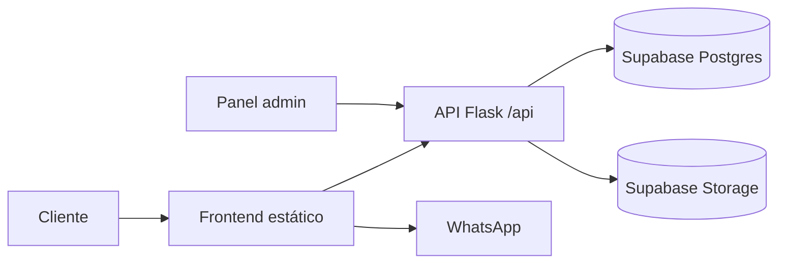

# Isaura Cerpa · Repostería Artesanal

<p align="center">
	
</p>

<p align="center"><strong>Una vitrina digital elegante para postres hechos con intención.</strong></p>

<p align="center">
	<a href="https://github.com/juandiego-uix/PASTELERIA_ISAURA/actions"></a>
	
	
	
	
</p>

Aplicación web de producción para **Isaura Cerpa**, una pastelería artesanal. El proyecto reemplaza la implementación PHP original por una arquitectura serverless moderna: Flask como API, Supabase como plataforma de datos y almacenamiento, y un frontend estático responsive sin dependencias de framework.

## Experiencia

- Catálogo dinámico con búsqueda por nombre y categoría.
- Selección de favoritos persistida en el navegador.
- Registro de pedidos en Supabase y continuación del flujo en WhatsApp.
- Panel administrativo protegido para gestionar productos, pedidos y estados.
- Métricas de pedidos pendientes, entregas mensuales y catálogo publicado.
- Estados de carga, errores visibles y validación en cliente y servidor.
- Diseño mobile-first con HTML semántico, CSS Grid/Flexbox y tipografía editorial.

## Stack tecnológico

| Capa | Tecnología |
| --- | --- |
| Backend | Python 3.11+, Flask 3.1 |
| Datos | Supabase Postgres + Storage |
| Frontend | HTML5, CSS moderno, JavaScript ES Modules |
| Despliegue | Vercel Serverless Functions + Static Files |
| Operación | Variables de entorno, RLS, tokens HMAC con expiración |

## Arquitectura

```text
ISAURA/
├── api/
│   ├── index.py             # App Flask, endpoints y validaciones
│   ├── __init__.py
│   └── requirements.txt     # Dependencias fijadas
├── public/
│   ├── index.html           # Tienda pública
│   ├── app.js               # Catálogo, favoritos y pedidos
│   ├── admin.html           # Panel administrativo
│   ├── admin.js             # Operaciones protegidas del panel
│   ├── styles.css
│   ├── admin.css
│   └── uploads/             # Activos históricos de la marca
├── supabase/
│   └── schema.sql           # Tablas, índices, RLS y bucket
├── .env.example             # Contrato de configuración
└── vercel.json              # Enrutamiento serverless + estático
```

Flujo principal:



## Instalación local

### 1. Requisitos

- Python 3.11 o superior.
- Una cuenta de Supabase.
- Node.js no es necesario para ejecutar el frontend.

### 2. Base de datos

1. Crea un proyecto en Supabase.
2. Ejecuta [`supabase/schema.sql`](supabase/schema.sql) en el SQL Editor.
3. Verifica que exista el bucket público `productos`.

### 3. Variables de entorno

```bash
cp .env.example .env
```

Completa `.env`:

```dotenv
SUPABASE_URL=https://tu-proyecto.supabase.co
SUPABASE_SERVICE_ROLE_KEY=clave-solo-servidor
ADMIN_USERNAME=isaura
ADMIN_PASSWORD=una-contraseña-larga-y-única
ADMIN_SESSION_SECRET=secreto-aleatorio-de-al-menos-32-bytes
ADMIN_SESSION_TTL=28800
```

`SUPABASE_SERVICE_ROLE_KEY` nunca debe enviarse al navegador ni subirse al repositorio.

### 4. Ejecutar Flask

```bash
python3 -m venv .venv
source .venv/bin/activate
python -m pip install -r api/requirements.txt
flask --app api.index run --debug
```

En desarrollo, sirve el frontend en otra terminal porque Flask atiende únicamente la API:

```bash
python3 -m http.server 8000 --directory public
```

Abre:

- Tienda: `http://127.0.0.1:8000/`
- Administración: `http://127.0.0.1:8000/admin.html`
- Salud de API: `http://127.0.0.1:5000/api/health`

## API principal

| Método | Ruta | Acceso | Propósito |
| --- | --- | --- | --- |
| `GET` | `/api/health` | Público | Estado del servicio |
| `GET` | `/api/products` | Público | Catálogo publicado |
| `GET` | `/api/categories` | Público | Categorías disponibles |
| `POST` | `/api/orders` | Público | Registrar pedido web |
| `POST` | `/api/auth/login` | Público | Crear sesión administrativa |
| `GET` | `/api/admin/dashboard` | Admin | Métricas y datos de gestión |
| `POST/PATCH/DELETE` | `/api/admin/products` | Admin | Gestionar productos |
| `POST/PATCH/DELETE` | `/api/admin/orders` | Admin | Gestionar pedidos |

Las respuestas de error mantienen el formato `{ "error": "mensaje" }` y usan códigos HTTP apropiados.

## Despliegue en Vercel

1. Importa el repositorio `juandiego-uix/PASTELERIA_ISAURA` en Vercel.
2. Mantén la raíz del proyecto como **Root Directory**.
3. Añade todas las variables de `.env` en **Project Settings → Environment Variables**.
4. Despliega. [`vercel.json`](vercel.json) dirige `/api/*` a Flask y sirve el frontend desde `public/`.

La clave service role solo se utiliza dentro de la función Python. El navegador recibe únicamente datos públicos y URLs de imágenes.

### Migrar imágenes existentes

Para cargar las imágenes históricas de `public/uploads/` al bucket `productos` y crear sus registros iniciales:

```bash
python script_migracion.py
```

El script usa `SUPABASE_URL` y `SUPABASE_KEY` desde `.env`, y puede ejecutarse de nuevo sin duplicar productos por nombre.

## Seguridad y operación

- Validación de tipos, longitudes, fechas, estados, pagos y archivos en el backend.
- Consultas privadas realizadas con la clave server-side de Supabase.
- RLS habilitado en las tablas y políticas públicas limitadas al catálogo.
- Sesiones administrativas firmadas con HMAC y caducidad configurable.
- Límite de 5 MB para cargas de imágenes y tipos MIME permitidos.
- Secretos excluidos mediante `.gitignore`.

## Licencia

Proyecto privado de Isaura Cerpa. El código y los activos visuales no deben redistribuirse sin autorización.
